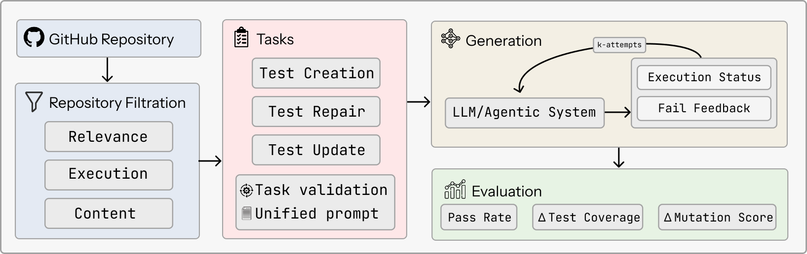
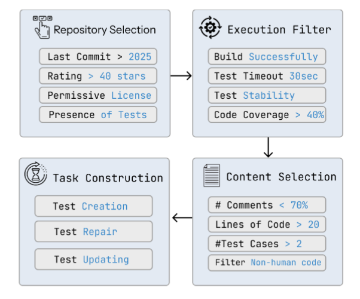
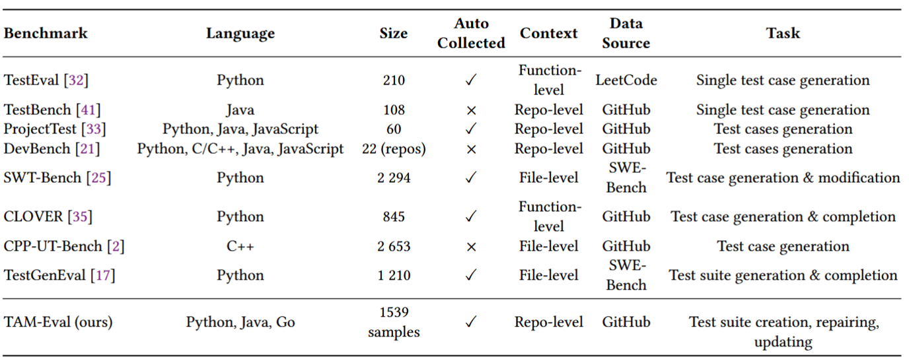
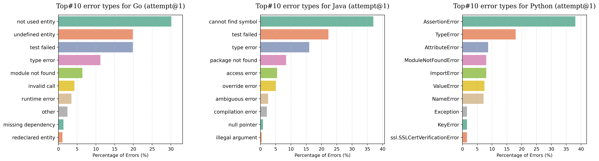
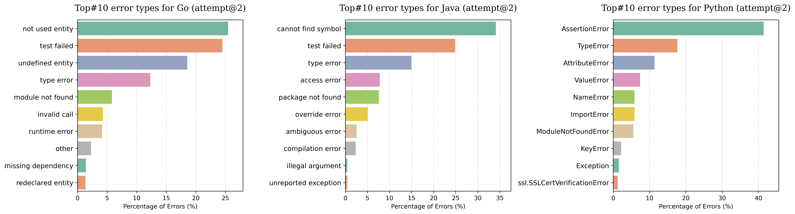
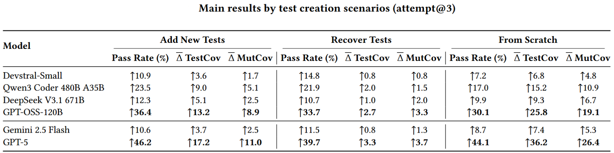
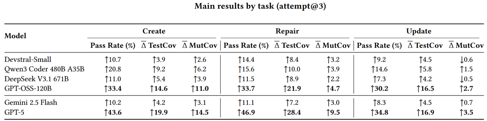

# TAM-Eval

## 🔍 Overview

TAM-Eval is an evaluation framework and benchmark for automated unit test maintenance.

<p align="center">
  <br>
</p>

## 🔥 Quick start

0. You should have [Docker](https://www.docker.com/) installed

1. Create new python env

```
python3.12 -m venv tenv
source tenv/bin/activate
```

2. Clone repo and install dependencies

```
git clone https://github.com/Tech871/tameval.git
cd tameval
pip install -r requirements.txt
```

and create `tameval/.env` with LLM_API_KEY (like in `tameval/.env_sample`)

3. An example script that reproduces the experiments can be used to run evaluation:

```
cd tameval
sh run_model_evals.sh
```

## Repo structure

```
tameval/
    ├── benchmark
    │   └── v1 # benchmark instances
    ├── run.py # main entrypoint
    ├── run_model_evals.sh # example run
    ├── setup/ # preparing stage scripts
    ├── generate/ # generation stage scripts
    ├── teval/ # evaluation stage scripts
    ├── download/ # dir for storing benchmark repos
    ├── outputs/  # dir for storing LLMs outputs
    └── results/  # dir for storing evaluation results
```

## Additional Materials

The `img` directory contains supplementary visual materials used for analysis and reporting:

- Diagrams illustrating **error types** for **Attempt @1** and **Attempt @2**
- Tables summarizing the **main results by tasks and scenarios** for **Attempt @3**

These materials provide additional insights into model performance and error patterns across different evaluation attempts.


<p align="center">
  <br>
  <em>Unit-Benchmark construction pipeline</em>
</p>

<p align="center">
  <br>
  <em>Unit-testing related benchmarks comparison</em>
</p>

***
### Error types

<p align="center">
  <br>
  <em>Error types (attempt 1)</em>
</p>

<p align="center">
  <br>
  <em>Error types (attempt 2)</em>
</p>

***
### Results

<p align="center">
  <br>
  <em>Main results by scenarios (attempt 3)</em>
</p>

<p align="center">
  <br>
  <em>Main results by task (attempt 3)</em>
</p>